.. |threat| image:: ../_static/icons/threat.svg

.. _colander_data_model:

Colander
========
.. toctree::
   :maxdepth: 1

Hi :colandertype:`Foobar: Top` top.
Hi :othertype:`misp:file` top.

This documentation page provides an overview of the different **Colander data types** - the core entity categories and
their specifications within the Colander threat intelligence data model.

Colander organizes threat intelligence data into eight primary entity super types, each representing a distinct
category of information relevant to cybersecurity analysis and threat hunting. This reference documents both the data
structure and available subtypes for each category.

Colander supports the following entity types:

* :ref:`Actors <actor_types>` - Individuals, groups, or organizations involved in threat activities
* :ref:`Artifacts <artifact_types>` - Files, documents, binaries, and other data objects
* :ref:`Data Fragments <data_fragment_types>` - Code snippets, text portions, and content fragments
* :ref:`Detection Rules <detection_rule_types>` - Rules and logic for identifying specific threats or patterns
* :ref:`Devices <device_types>` - Physical or virtual systems, hardware, and infrastructure components
* :ref:`Events <event_types>` - Temporal occurrences, alerts, detections, and log entries
* :ref:`Observables <observable_types>` - Detectable entities like IP addresses, domains, file hashes, and URLs
* :ref:`Threats <threat_types>` - Malicious entities such as malware families, campaigns, and attack techniques

|colander|

.. _colander_feed_structure:

Colander feed structure
-----------------------

A Colander feed
(:py:class:`~colander_data_converter.base.models.ColanderFeed`)
is a collection of entities, relations, and cases, represented as a JSON object with the following
top-level structure:

- ``id``: Unique identifier for the feed (UUID).
- ``name``: Human-readable name for the feed.
- ``description``: Optional description of the feed.
- ``entities``: Dictionary of entity objects, keyed by their IDs.
- ``relations``: Dictionary of relation objects, keyed by their IDs.
- ``cases``: Dictionary of case objects, keyed by their IDs.

Relations between entities
--------------------------

Defined by :py:class:`~colander_data_converter.base.models.EntityRelation`.

Top-level structure:

- ``id``: Unique identifier (UUID)
- ``created_at``: Creation timestamp
- ``updated_at``: Last update timestamp
- ``name``: Name of the relation
- ``case``: Reference to the case this relation belongs to
- ``attributes``: Dictionary of additional attributes
- ``obj_from``: Source entity or reference
- ``obj_to``: Target entity or reference

.. _actor_types:

|actor| Actors
--------------

An actor (:py:class:`~colander_data_converter.base.models.Actor`) represents an individual or group involved in an
event, activity, or system.

Top-level structure:

- ``id``: Unique identifier (UUID)
- ``created_at``: Creation timestamp
- ``updated_at``: Last update timestamp
- ``name``: Name of the actor
- ``type``: Actor type
- ``case``: Reference to the case
- ``description``: Description
- ``pap``: PAP level
- ``source_url``: Optional source URL
- ``tlp``: TLP level
- ``attributes``: Dictionary of additional attributes

.. datatemplate:json:: ../../colander_data_converter/data/types/actor_types.json
   :template: colander-type.tmpl

.. _artifact_types:

|artifact| Artifacts
--------------------
An artifact (:py:class:`~colander_data_converter.base.models.Artifact`) represents a file or data object, such as a
document, image, or binary, within a system.

Top-level structure:

- ``id``: Unique identifier (UUID)
- ``created_at``: Creation timestamp
- ``updated_at``: Last update timestamp
- ``name``: Name of the artifact
- ``type``: Artifact type
- ``case``: Reference to the case
- ``description``: Description
- ``pap``: PAP level
- ``source_url``: Optional source URL
- ``tlp``: TLP level
- ``attributes``: Dictionary of additional attributes
- ``extracted_from``: Reference to the device
- ``extension``: File extension
- ``original_name``: Original file name
- ``mime_type``: MIME type
- ``detached_signature``: Optional signature
- ``md5``: MD5 hash
- ``sha1``: SHA1 hash
- ``sha256``: SHA256 hash
- ``size_in_bytes``: Size in bytes

.. datatemplate:json:: ../../colander_data_converter/data/types/artifact_types.json
   :template: colander-type.tmpl
   :data_type: artifact

.. _data_fragment_types:

|datafragment| Data Fragments
-----------------------------
A data fragment (:py:class:`~colander_data_converter.base.models.DataFragment`) represents a fragment of data, such
as a code snippet, text, or other content.

Top-level structure:

- ``id``: Unique identifier (UUID)
- ``created_at``: Creation timestamp
- ``updated_at``: Last update timestamp
- ``name``: Name of the data fragment
- ``type``: Data fragment type
- ``case``: Reference to the case
- ``description``: Description
- ``pap``: PAP level
- ``source_url``: Optional source URL
- ``tlp``: TLP level
- ``content``: Content of the fragment
- ``extracted_from``: Reference to the artifact

.. datatemplate:json:: ../../colander_data_converter/data/types/data_fragment_types.json
   :template: colander-type.tmpl
   :data_type: data_fragment

.. _detection_rule_types:

|detectionrule| Detection Rules
-------------------------------
A detection rule (:py:class:`~colander_data_converter.base.models.DetectionRule`) represents a rule used for detecting
specific content or logic related to observables.

Top-level structure:

- ``id``: Unique identifier (UUID)
- ``created_at``: Creation timestamp
- ``updated_at``: Last update timestamp
- ``name``: Name of the detection rule
- ``type``: Detection rule type
- ``case``: Reference to the case
- ``description``: Description
- ``pap``: PAP level
- ``source_url``: Optional source URL
- ``tlp``: TLP level
- ``content``: Rule content
- ``targeted_observables``: List of observables or references

.. datatemplate:json:: ../../colander_data_converter/data/types/detection_rule_types.json
   :template: colander-type.tmpl
   :data_type: detection_rule

.. _device_types:

|device| Devices
----------------
A device (:py:class:`~colander_data_converter.base.models.Device`) represents a physical or virtual device in a system.

Top-level structure:

- ``id``: Unique identifier (UUID)
- ``created_at``: Creation timestamp
- ``updated_at``: Last update timestamp
- ``name``: Name of the device
- ``type``: Device type
- ``case``: Reference to the case
- ``description``: Description
- ``pap``: PAP level
- ``source_url``: Optional source URL
- ``tlp``: TLP level
- ``attributes``: Dictionary of additional attributes
- ``operated_by``: Reference to the actor

.. datatemplate:json:: ../../colander_data_converter/data/types/device_types.json
   :template: colander-type.tmpl
   :data_type: device

.. _event_types:

|event| Events
--------------
An event (:py:class:`~colander_data_converter.base.models.Event`) represents an occurrence or activity observed
within a system, such as a detection, alert, or log entry.

Top-level structure:

- ``id``: Unique identifier (UUID)
- ``created_at``: Creation timestamp
- ``updated_at``: Last update timestamp
- ``name``: Name of the event
- ``type``: Event type
- ``case``: Reference to the case
- ``description``: Description
- ``pap``: PAP level
- ``source_url``: Optional source URL
- ``tlp``: TLP level
- ``attributes``: Dictionary of additional attributes
- ``first_seen``: First observed timestamp
- ``last_seen``: Last observed timestamp
- ``count``: Number of times observed
- ``extracted_from``: Reference to the artifact
- ``observed_on``: Reference to the device
- ``detected_by``: Reference to the detection rule
- ``attributed_to``: Reference to the actor attributed to the event
- ``target``: Reference to the actor targeted during the event
- ``involved_observables``: List of observables or references

.. datatemplate:json:: ../../colander_data_converter/data/types/event_types.json
   :template: colander-type.tmpl
   :data_type: event

.. _observable_types:

|observable| Observables
------------------------
An observable (:py:class:`~colander_data_converter.base.models.Observable`) represents an entity such as an IP address
that can be observed or detected within a system.

Top-level structure:

- ``id``: Unique identifier (UUID)
- ``created_at``: Creation timestamp
- ``updated_at``: Last update timestamp
- ``name``: Name of the observable
- ``type``: Observable type
- ``case``: Reference to the case
- ``description``: Description
- ``pap``: PAP level
- ``source_url``: Optional source URL
- ``tlp``: TLP level
- ``attributes``: Dictionary of additional attributes
- ``classification``: Classification label
- ``raw_value``: Raw value
- ``extracted_from``: Reference to the artifact
- ``associated_threat``: Reference to a threat
- ``operated_by``: Reference to the actor

.. datatemplate:json:: ../../colander_data_converter/data/types/observable_types.json
   :template: colander-type.tmpl
   :data_type: observable

.. _threat_types:

|threat| Threats
----------------
A threat (:py:class:`~colander_data_converter.base.models.Threat`) represents a potentially malicious entity, such
as a malware family, campaign, or adversary.

Top-level structure:

- ``id``: Unique identifier (UUID)
- ``created_at``: Creation timestamp
- ``updated_at``: Last update timestamp
- ``name``: Name of the threat
- ``type``: Threat type
- ``case``: Reference to the case
- ``description``: Description
- ``pap``: PAP level
- ``source_url``: Optional source URL
- ``tlp``: TLP level

.. datatemplate:json:: ../../colander_data_converter/data/types/threat_types.json
   :template: colander-type.tmpl
   :data_type: threat
