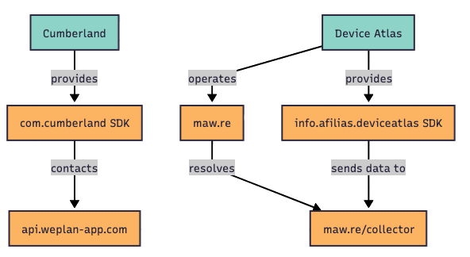

Export data
===========
.. toctree::
   :maxdepth: 1

This Python module supports multiple export formats. However, once exported, data cannot be loaded with :py:mod:`colander_data_converter`.

.. _Graphviz: https://graphviz.org/
.. _Mermaid: https://www.mermaidchart.com
.. _Jinja2: https://jinja.palletsprojects.com/

Mermaid
--------
The Mermaid_ exporter generates text files that can be used to create visual representations of entity relationships and hierarchies.

For more details, check the documentation of :py:class:`~colander_data_converter.exporters.mermaid.MermaidExporter`.

.. code-block:: python

    import json

    from colander_data_converter.base.models import ColanderFeed
    from colander_data_converter.exporters.mermaid import MermaidExporter

    # Load the feed
    with open("path/to/colander_feed.json", "r") as f:
        raw = json.load(f)
    colander_feed = ColanderFeed.load(raw)

    # Export the feed as a graph
    exporter = MermaidExporter(colander_feed)
    with open("path/to/colander_feed.txt", "w") as f:
        exporter.export(f)

Graphviz
--------
The Graphviz_ exporter generates DOT format files that can be used to create visual representations of entity relationships and hierarchies. It uses customizable themes to control the visual styling of the generated graphs.

For more details, check the documentation of :py:class:`~colander_data_converter.exporters.graphviz.GraphvizExporter`.

.. code-block:: python

    import json

    from colander_data_converter.base.models import ColanderFeed
    from colander_data_converter.exporters.graphviz import GraphvizExporter

    # Load the feed
    with open("path/to/colander_feed.json", "r") as f:
        raw = json.load(f)
    colander_feed = ColanderFeed.load(raw)

    # Export the feed as a graph
    exporter = GraphvizExporter(colander_feed)
    with open("path/to/colander_feed.dot", "w") as f:
        exporter.export(f)

Template
--------
The template exporter uses Jinja2_ templates to generate custom output formats. It supports both file-based templates and source-based templates, with automatic sandboxing for security.

For more details, check the documentation of :py:class:`~colander_data_converter.exporters.template.TemplateExporter`.

.. code-block:: python

    import json

    from colander_data_converter.base.models import ColanderFeed
    from colander_data_converter.exporters.template import TemplateExporter

    templates_folder = "path/to/templates"
    template_name = "example.jinja2"

    # Load the feed
    with open("path/to/colander_feed.json", "r") as f:
        raw = json.load(f)
    colander_feed = ColanderFeed.load(raw)

    # Render the template
    exporter = TemplateExporter(colander_feed, templates_folder, template_name)
    with open("path/to/colander_feed.txt", "w") as f:
        exporter.export(f, title="Example")

    # Using source code of the template
    from jinja2 import Template

    template_source = "Report: {{ title }}\nEntities: {{ feed.entities | length }}"
    exporter = TemplateExporter(
        colander_feed,
        "",
        "",
        template_source=template_source
    )
    with open("path/to/report.txt", "w") as f:
        exporter.export(f, title="Security Report")

.. danger::
    When using the template exporter, be aware of the security considerations. Templates are executed in a sandboxed Jinja2 environment that restricts access to potentially dangerous operations.

    For production environments, always prefer file-based templates.

CSV
---
The CSV exporter generates comma-separated values files containing entity data. It supports exporting specific entity types and allows customization of CSV formatting options.

For more details, check the documentation of :py:class:`~colander_data_converter.exporters.csv.CsvExporter`.

.. code-block:: python

    import json

    from colander_data_converter.base.models import ColanderFeed, Observable
    from colander_data_converter.exporters.csv import CsvExporter

    # Load the feed
    with open("path/to/colander_feed.json", "r") as f:
        raw = json.load(f)
    colander_feed = ColanderFeed.load(raw)

    # Export all observables in CSV
    exporter = CsvExporter(colander_feed, Observable)
    with open("path/to/colander_feed.csv", "w") as f:
        exporter.export(f)

    # Custom CSV formatting
    exporter = CsvExporter(colander_feed, Observable)
    with open("path/to/custom_format.csv", "w") as f:
        exporter.export(f, delimiter=";", quoting=csv.QUOTE_ALL)
