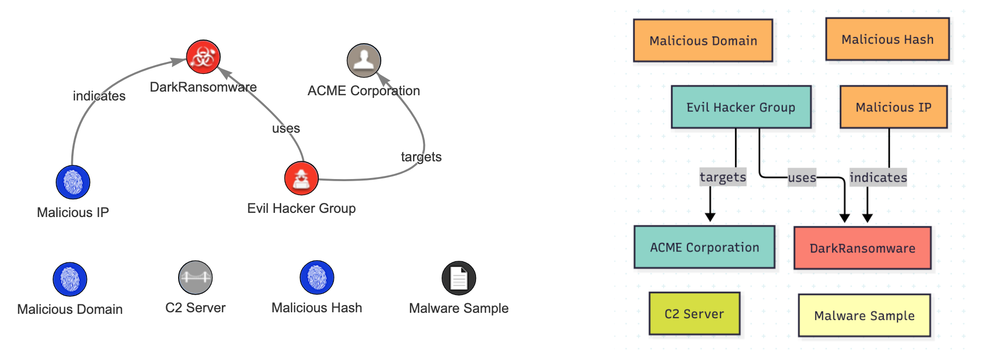

Tips and Tricks
===============

Convert and export
------------------

.. _Mermaid: https://www.mermaidchart.com
.. _STIX2: https://oasis-open.github.io/cti-documentation/stix/intro

The converter uses Colander's data model as its internal representation, enabling you to chain conversions and
exports. This example demonstrates converting a STIX2_ bundle and exporting it as a Mermaid_ diagram.

**STIX2 to Mermaid conversion**

.. code-block:: python

    import json
    from pathlib import Path

    from colander_data_converter.converters.stix2.converter import Stix2Converter
    from colander_data_converter.exporters.mermaid import MermaidExporter

    # Define file paths
    stix2_bundle_file = Path("path/to/stix2_bundle.json")
    output_file = Path("path/to/mermaid_output.txt")

    # Load STIX2 data from JSON
    with stix2_bundle_file.open("r") as f:
        stix2_data = json.load(f)

    # Convert STIX2 bundle to Colander feed
    colander_feed = Stix2Converter.stix2_to_colander(stix2_data)

    # Create Mermaid exporter and generate diagram
    exporter = MermaidExporter(colander_feed)
    with output_file.open("w") as f:
        exporter.export(f)
